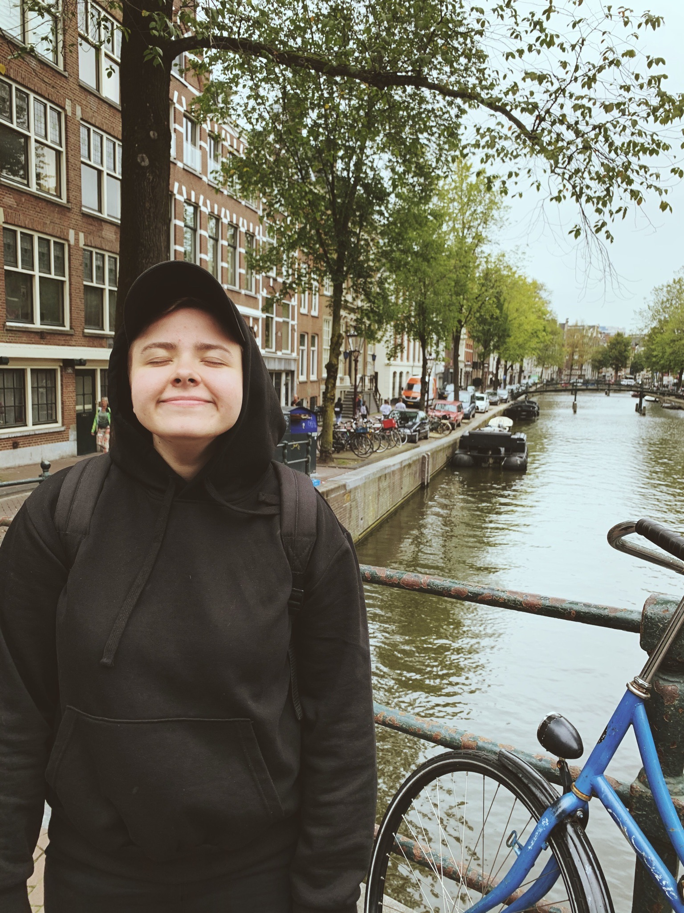
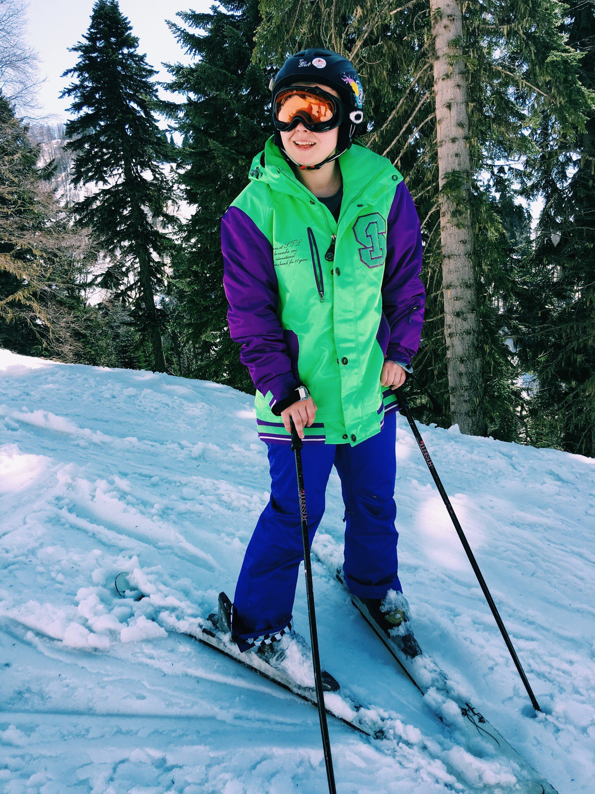
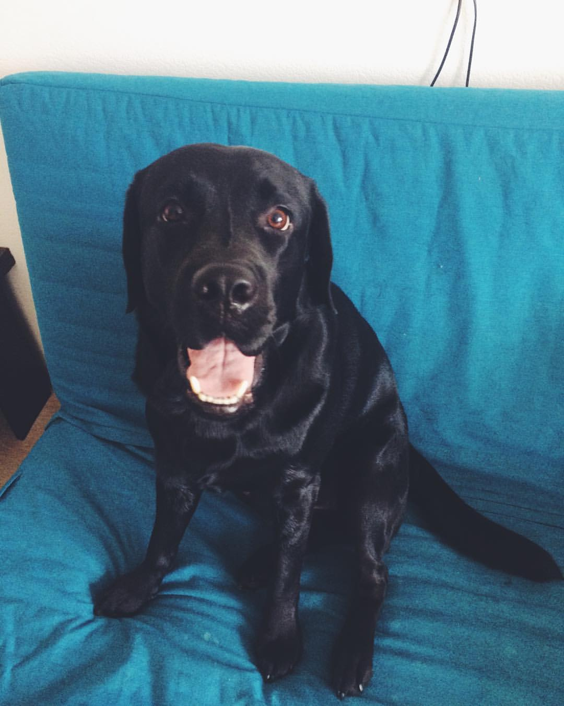

# Обо мне 
## Меня зовут Аня

- Мне 26 лет
- Я живу в Санкт-Петербурге.
- Работаю в компании  **AmRest** 7 лет.
Устроилась на работу во время учебы в вузе году простым кассиром в ресторан KFC. После получения высшего образования осталась в компании и начала свое развитие по карьерной лестнице.
Уже 2 года я занимаю должность заместителя директора ресторана.
Работа интересная, связана с общением с большим количеством людей (коллеги, сотрудники, гости).
- В свободное от работы время, я люблю гулять по городу. Люблю активные виды спорта. В школе занималась баскетболом. А также обожаю путешествовать.

- У меня есть неугомонный лабрадор по кличке Барри.

- В данный момент обучаюсь в Нетологии на курсе Тестировщик ПО. 
- **Спасибо всем преподавателям курса, вы классные!**
